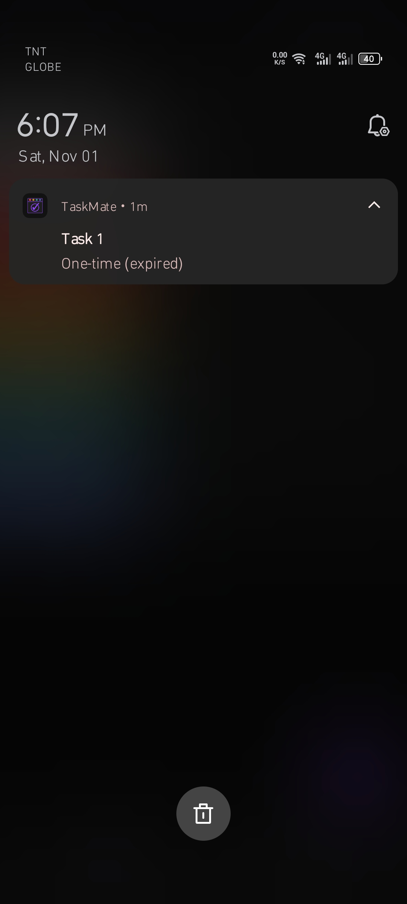

# TaskMate
TaskMate is a simple Android application that helps users manage their tasks through a calendar and list-based interface. It uses visual cues like colored dots and list highlights to indicate task urgency and type.

## Features
- Calendar view with urgency-based dot icons.
- List view with color-coded task entries.
- Add, edit, and delete tasks with title, description, date, time, and type.
- Sort tasks by creation date, due date, or schedule type.
- Restore notifications after device reboot or restart (either automatically or manually).
- SQLite database for local task storage.

## Color Indicators
TaskMate uses color-coded visuals to represent task urgency and type across both the calendar and list views.
- **Gray**: Expired one-time task (past due).
- **Red**: High urgency (3 days before deadline).
- **Yellow**: Moderate urgency (7 days before deadline).
- **Green**: Low urgency (more than 7 days).
- **Blue**: Recurring task (weekly).
> Calendar dots are limited to one or two per date, depending on task type. We do not stack multiple dots. Dual-dot logic applies only when both weekly and one-time tasks fall on the same day.

## Screenshots

 
  
Click to view screenshots
 
  
  
  
  
   
  
  
  
   
  
  

## Download
Download here:  
**[TaskMate v1.0.0 (Release APK)](app/release/)**  
**[Download via itch.io](https://guest-22.itch.io/taskmate)**
> Works on Android 8.0 (API 26) and above. After installing, open the app and allow notifications when prompted.
